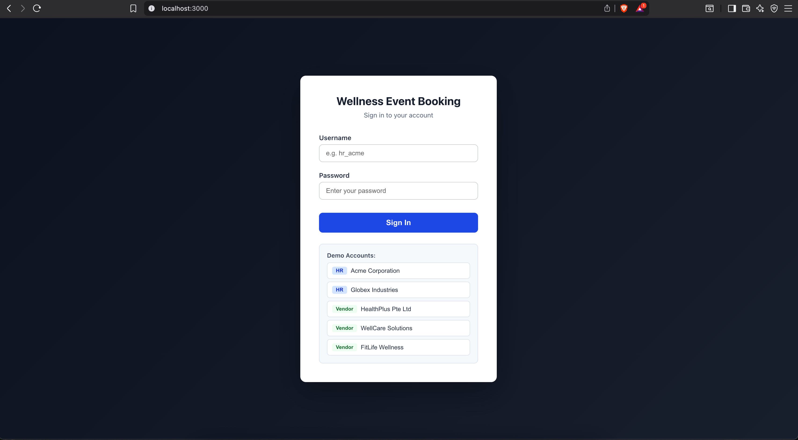
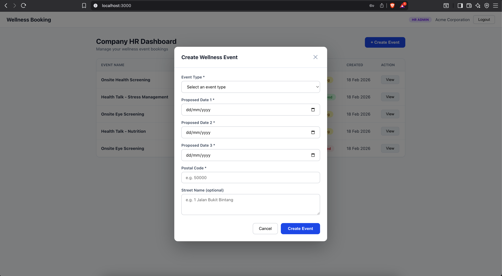
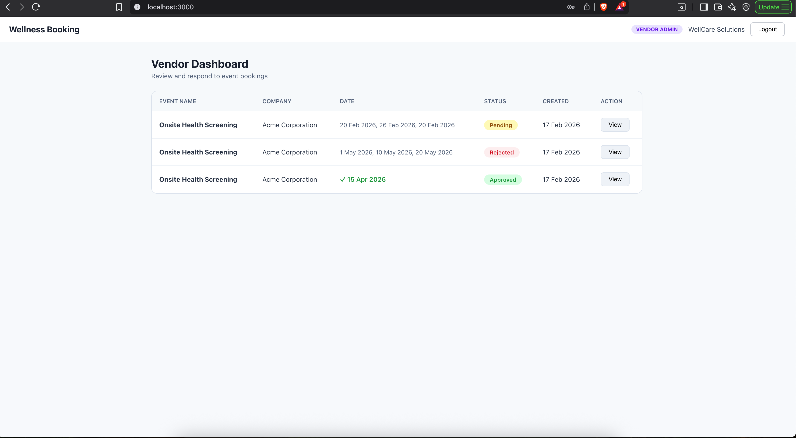
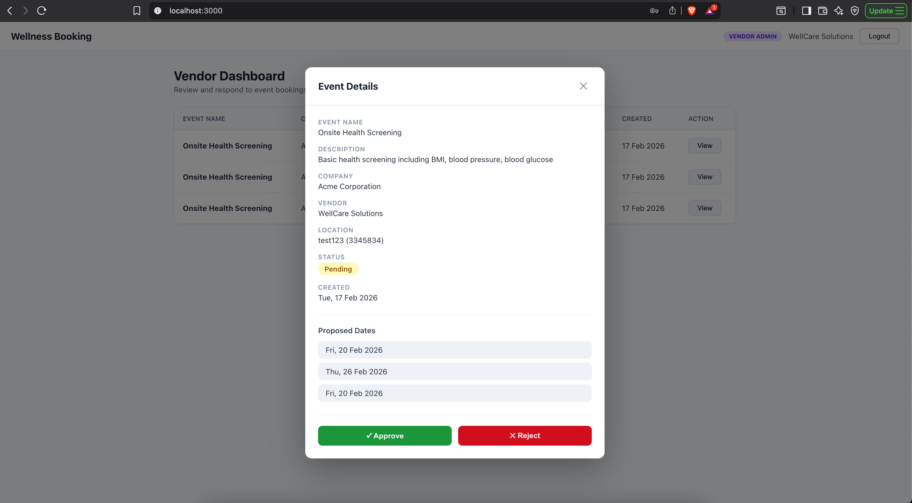

# Wellness Event Booking System

A full-stack web application for online booking of wellness events (health talks, onsite screenings, etc.) with vendor approval/rejection workflow.

## Tech Stack

- **Frontend:** React (Vite)
- **Backend:** Node.js + Express
- **Database:** MongoDB (Atlas)

---

## ER Diagram
```
┌──────────────────┐       ┌──────────────────────────┐
│      Users       │       │     EventTypes           │
├──────────────────┤       ├──────────────────────────┤
│ _id              │       │ _id                      │
│ username         │◄──────│ vendor (ref → Users)     │
│ password (hash)  │       │ name                     │
│ role (hr/vendor) │       │ description              │
│ companyName      │       └──────────────────────────┘
└──────────────────┘
         │ createdBy / vendor
         ▼
┌──────────────────────────────────┐
│          Events                   │
├──────────────────────────────────┤
│ _id                               │
│ eventType (ref → EventTypes)      │
│ companyName (auto from HR)        │
│ proposedDates [Date, Date, Date]  │
│ location { postalCode, street }   │
│ status (pending/approved/rejected)│
│ remarks (rejection reason)        │
│ confirmedDate                     │
│ createdBy (ref → Users)          │
│ vendor (ref → Users)             │
│ createdAt                         │
│ updatedAt                         │
└──────────────────────────────────┘
```

## Application Flow
```
HR logs in → Creates Event (selects type, 3 dates, location)
  → Event auto-assigned to tagged Vendor
  → Vendor logs in → Sees pending events
  → Vendor clicks View → Approves (selects 1 date) or Rejects (with reason)
  → Status updates for both HR and Vendor
```

---

## Setup Instructions

### Prerequisites
- Node.js 18+
- MongoDB Atlas account (or local MongoDB)

### 1. Install Dependencies
```bash
# Server
cd server
npm install

# Client
cd ../client
npm install
```

### 2. Configure Environment

Edit `server/.env`:
```
PORT=5000
MONGODB_URI=your-mongodb-connection-string
JWT_SECRET=your-secret-key
JWT_EXPIRES_IN=7d
```

### 3. Seed the Database
```bash
cd server
npm run seed
```

### 4. Run the Application
```bash
# Terminal 1: Start server
cd server
npm run dev

# Terminal 2: Start client
cd client
npm run dev
```

- Frontend: http://localhost:3000
- Backend: http://localhost:5000

---

## Pre-Created Accounts

| Role   | Username           | Password    | Company              |
|--------|--------------------|-------------|----------------------|
| HR     | hr_acme            | password123 | Acme Corporation     |
| HR     | hr_globex          | password123 | Globex Industries    |
| Vendor | vendor_healthplus  | password123 | HealthPlus Pte Ltd   |
| Vendor | vendor_wellcare    | password123 | WellCare Solutions   |
| Vendor | vendor_fitlife     | password123 | FitLife Wellness     |

## Event Types

| Event Type                      | Tagged Vendor        |
|---------------------------------|----------------------|
| Health Talk - Stress Management | HealthPlus Pte Ltd   |
| Health Talk - Nutrition         | HealthPlus Pte Ltd   |
| Onsite Health Screening         | WellCare Solutions   |
| Onsite Eye Screening            | WellCare Solutions   |
| Fitness Workshop - Yoga         | FitLife Wellness     |
| Fitness Workshop - HIIT         | FitLife Wellness     |

---

## User Guide

### 1. Login Page
Enter username and password. The system detects your role (HR or Vendor) and shows the appropriate dashboard.



### 2. HR Dashboard
- View all events you have created
- Click **"+ Create Event"** to book a new wellness event
- Select event type (dropdown), pick 3 proposed dates, enter location
- Company name is auto-populated from your account
- Vendor is auto-assigned based on the event type


### 3. Create Event
- Select an event type from the dropdown
- Choose 3 proposed dates
- Enter postal code and optional street name
- Click "Create Event"



### 4. Vendor Dashboard
- View all events assigned to you
- Click **"View"** to see event details
- For pending events: **Approve** (select a date) or **Reject** (provide reason)



### 5. Approve / Reject
- **Approve:** Select one of the 3 proposed dates as the confirmed date
- **Reject:** Enter a reason for rejection



---

## API Endpoints

| Method | Endpoint                 | Auth | Role   | Description         |
|--------|--------------------------|------|--------|---------------------|
| POST   | /api/auth/login          | No   | —      | Login               |
| GET    | /api/auth/me             | Yes  | Any    | Get current user    |
| GET    | /api/events              | Yes  | Any    | List events         |
| GET    | /api/events/:id          | Yes  | Any    | Get event details   |
| POST   | /api/events              | Yes  | HR     | Create event        |
| PATCH  | /api/events/:id/approve  | Yes  | Vendor | Approve event       |
| PATCH  | /api/events/:id/reject   | Yes  | Vendor | Reject event        |
| GET    | /api/event-types         | Yes  | Any    | List event types    |

---

## Sample JSON Documents

### User
```json
{
  "_id": "65a1b2c3d4e5f6a7b8c9d0e1",
  "username": "hr_acme",
  "password": "$2b$12$...(hashed)",
  "role": "hr",
  "companyName": "Acme Corporation",
  "createdAt": "2026-02-17T10:00:00.000Z",
  "updatedAt": "2026-02-17T10:00:00.000Z"
}
```

### Event
```json
{
  "_id": "65a1b2c3d4e5f6a7b8c9d0e4",
  "eventType": "65a1b2c3d4e5f6a7b8c9d0e2",
  "companyName": "Acme Corporation",
  "proposedDates": [
    "2026-04-10T00:00:00.000Z",
    "2026-04-15T00:00:00.000Z",
    "2026-04-20T00:00:00.000Z"
  ],
  "location": {
    "postalCode": "048616",
    "streetName": "1 Raffles Place"
  },
  "status": "approved",
  "remarks": "",
  "confirmedDate": "2026-04-15T00:00:00.000Z",
  "createdBy": "65a1b2c3d4e5f6a7b8c9d0e1",
  "vendor": "65a1b2c3d4e5f6a7b8c9d0e3",
  "createdAt": "2026-02-17T10:30:00.000Z",
  "updatedAt": "2026-02-17T11:00:00.000Z"
}
```

---

## Design Decisions

- **No hardcoding:** All accounts, event types, and events are database-driven
- **Role-based access:** Middleware enforces HR-only and Vendor-only routes
- **Auto-assignment:** Vendor is determined by the event type selection, not manually
- **Data isolation:** Each user only sees their own events (HR sees created, Vendor sees assigned)
- **Password security:** bcrypt hashing with salt rounds of 12
- **JWT authentication:** Stateless, scalable token-based auth
- **Input validation:** Both at API level and database schema level
